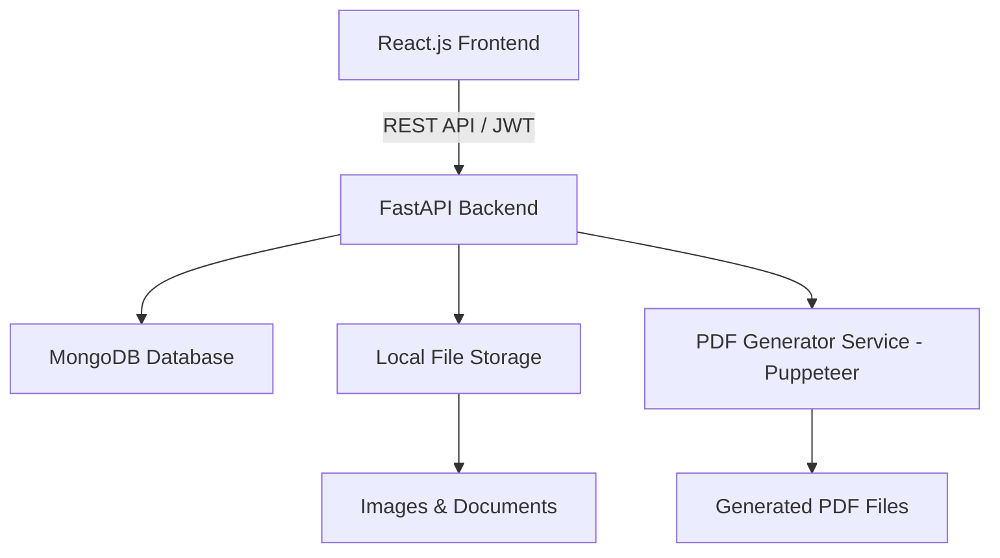

# Property Deal Management Platform — System Specification

## Overview

An **MVP** web application that enables an **Admin** to manage property listings (buying & selling), capture essential property details, upload images and legal documents, and generate a **PDF deal document** — all in the shortest path to a working product.

<user_quoted_section>MVP Scope: Only the core features needed to close a property deal are included. Advanced features (analytics, email notifications, multi-role users, mobile app) are deferred to future iterations.</user_quoted_section>

## Tech Stack

| Layer | Technology |
| --- | --- |
| Frontend | React.js (Vite) |
| Backend | Python + FastAPI |
| Database | MongoDB (via Motor async driver) |
| File Storage | Local/Server Storage (served via FastAPI static files) |
| PDF Generation | Puppeteer (Node.js microservice or via a dedicated PDF service) |
| Authentication | JWT (JSON Web Tokens) |

## System Architecture



## User Roles

| Role | Capabilities |
| --- | --- |
| **Admin** | Single hardcoded admin — login, manage properties, upload files, generate PDFs |

<user_quoted_section>MVP has one admin user seeded via a script. No user management UI needed.</user_quoted_section>

## MVP Modules

### 1. Authentication (MVP)

- Admin login with email & password → JWT issued
- JWT stored in `localStorage`, sent as `Authorization: Bearer` header
- All pages except `/login` are protected
- ~~Token refresh~~ — deferred; simple expiry is sufficient for MVP

### 2. Property Management (MVP)

Only **essential fields** are captured in MVP:

| Field | Type | MVP? |
| --- | --- | --- |
| `title` | String | ✅ |
| `type` | Enum (Residential/Commercial/Land/Industrial) | ✅ |
| `deal_type` | Enum (Buy/Sell) | ✅ |
| `location` | String | ✅ |
| `area` | Number (sq.ft) | ✅ |
| `price` | Number | ✅ |
| `description` | Text | ✅ |
| `amenities` | String (comma-separated) | ✅ |
| `seller_name` | String | ✅ |
| `seller_contact` | String | ✅ |
| `seller_id_proof` | File upload | ✅ |
| `buyer_name` | String | ✅ |
| `buyer_contact` | String | ✅ |
| `buyer_id_proof` | File upload | ✅ |
| `deal_price` | Number | ✅ |
| `payment_mode` | Enum | ✅ |
| `possession_date` | Date | ✅ |
| `deal_status` | Enum (Draft/Active/Negotiation/Closed) | ✅ |
| `created_at` | DateTime (auto) | ✅ |
| `signature_fields` | Object | ❌ Deferred — placeholder text in PDF only |

### 3. File Uploads (MVP)

- Upload multiple property images (JPEG, PNG — max 5MB each)
- Upload legal documents (PDF, JPG — max 20MB each)
- Single file for seller & buyer ID proof
- Files saved to `/uploads/properties/{id}/` on the server
- FastAPI serves files as static URLs
- ~~Drag-and-drop UI~~ — deferred; simple `<input type="file" multiple>` is sufficient for MVP

### 4. PDF Generation (MVP)

- Puppeteer Node.js service generates PDF from an HTML template
- PDF contains: property info, up to 4 images, seller/buyer details, deal terms, document list, signature placeholder boxes
- Admin clicks **"Generate PDF"** → PDF saved on server → **"Download PDF"** button appears
- ~~Platform logo/branding~~ — deferred; plain header text is sufficient for MVP

### 5. Deal Status (MVP)

- Simple status dropdown on the property detail page (no animated pipeline needed for MVP)
- Admin selects status and saves — `Draft → Active → Negotiation → Closed`

## What's NOT in MVP (Deferred)

| Feature | Reason |
| --- | --- |
| Email notifications | Not critical to close a deal |
| Dashboard analytics | No data volume yet |
| Multi-role users (Agent, Buyer, Seller) | Single admin is sufficient |
| Digital signatures | Complex integration, deferred |
| Drag-and-drop file upload | Nice-to-have UX |
| Token refresh | Simple expiry works for MVP |
| Mobile responsive design | Desktop-first for MVP |

## MVP API Endpoints (FastAPI)

| Method | Endpoint | Description |
| --- | --- | --- |
| POST | `/auth/login` | Admin login → JWT |
| GET | `/properties` | List properties (basic search by title/location) |
| POST | `/properties` | Create property |
| GET | `/properties/{id}` | Get property details |
| PUT | `/properties/{id}` | Update property |
| DELETE | `/properties/{id}` | Delete property |
| POST | `/properties/{id}/images` | Upload images |
| POST | `/properties/{id}/documents` | Upload documents |
| POST | `/properties/{id}/generate-pdf` | Generate PDF |
| GET | `/properties/{id}/download-pdf` | Download PDF |

<user_quoted_section>Filters on GET /properties are limited to a simple text search in MVP. Type/status filters are deferred.</user_quoted_section>

## UI Pages & Wireframes

### Login Page

```wireframe

<html>
<head>
<style>
* { box-sizing: border-box; margin: 0; padding: 0; font-family: sans-serif; }
body { background: #f4f6f8; display: flex; justify-content: center; align-items: center; height: 100vh; }
.card { background: #fff; padding: 40px; border-radius: 8px; width: 380px; box-shadow: 0 2px 12px rgba(0,0,0,0.1); }
h2 { text-align: center; margin-bottom: 8px; font-size: 22px; }
p { text-align: center; color: #888; font-size: 13px; margin-bottom: 24px; }
label { font-size: 13px; color: #444; display: block; margin-bottom: 4px; }
input { width: 100%; padding: 10px 12px; border: 1px solid #ddd; border-radius: 6px; margin-bottom: 16px; font-size: 14px; }
button { width: 100%; padding: 12px; background: #2563eb; color: #fff; border: none; border-radius: 6px; font-size: 15px; cursor: pointer; }
</style>
</head>
<body>
<div class="card">
  <h2>🏠 PropDeal Admin</h2>
  <p>Sign in to manage property deals</p>
  <label>Email Address</label>
  <input type="email" placeholder="admin@propdeal.com" data-element-id="email-input" />
  <label>Password</label>
  <input type="password" placeholder="••••••••" data-element-id="password-input" />
  <button data-element-id="login-btn">Sign In</button>
</div>
</body>
</html>
```

### Properties Dashboard

```wireframe

<html>
<head>
<style>
* { box-sizing: border-box; margin: 0; padding: 0; font-family: sans-serif; }
body { background: #f4f6f8; }
.navbar { background: #1e3a5f; color: #fff; padding: 14px 24px; display: flex; justify-content: space-between; align-items: center; }
.navbar h1 { font-size: 18px; }
.navbar span { font-size: 13px; opacity: 0.8; }
.container { padding: 24px; }
.topbar { display: flex; justify-content: space-between; align-items: center; margin-bottom: 20px; }
.topbar h2 { font-size: 20px; }
.btn-primary { background: #2563eb; color: #fff; border: none; padding: 10px 18px; border-radius: 6px; cursor: pointer; font-size: 14px; }
.filters { display: flex; gap: 10px; margin-bottom: 20px; }
.filters input, .filters select { padding: 8px 12px; border: 1px solid #ddd; border-radius: 6px; font-size: 13px; }
.grid { display: grid; grid-template-columns: repeat(3, 1fr); gap: 16px; }
.card { background: #fff; border-radius: 8px; overflow: hidden; box-shadow: 0 1px 6px rgba(0,0,0,0.08); }
.card-img { background: #dde3ec; height: 140px; display: flex; align-items: center; justify-content: center; color: #888; font-size: 13px; }
.card-body { padding: 14px; }
.card-body h3 { font-size: 15px; margin-bottom: 4px; }
.card-body p { font-size: 12px; color: #666; margin-bottom: 8px; }
.badge { display: inline-block; padding: 3px 8px; border-radius: 12px; font-size: 11px; background: #dbeafe; color: #1d4ed8; margin-bottom: 8px; }
.badge.sell { background: #fef3c7; color: #92400e; }
.badge.closed { background: #d1fae5; color: #065f46; }
.card-footer { display: flex; justify-content: space-between; font-size: 12px; color: #888; }
.price { font-weight: bold; color: #1e3a5f; font-size: 14px; }
</style>
</head>
<body>
<div class="navbar">
  <h1>🏠 PropDeal Admin</h1>
  <span>Welcome, Admin ▾</span>
</div>
<div class="container">
  <div class="topbar">
    <h2>All Properties</h2>
    <button class="btn-primary" data-element-id="add-property-btn">+ Add Property</button>
  </div>
  <div class="filters">
    <input type="text" placeholder="🔍 Search by title or location..." data-element-id="search-input" style="width:260px" />
    <select data-element-id="type-filter"><option>All Types</option><option>Residential</option><option>Commercial</option><option>Land/Plot</option><option>Industrial</option></select>
    <select data-element-id="deal-filter"><option>Buy & Sell</option><option>Buy</option><option>Sell</option></select>
    <select data-element-id="status-filter"><option>All Status</option><option>Draft</option><option>Active</option><option>Negotiation</option><option>Closed</option></select>
  </div>
  <div class="grid">
    <div class="card">
      <div class="card-img">[ Property Image ]</div>
      <div class="card-body">
        <span class="badge">Residential · Buy</span>
        <h3>3BHK Villa, Jubilee Hills</h3>
        <p>📍 Jubilee Hills, Hyderabad</p>
        <p class="price">₹ 1,20,00,000</p>
        <div class="card-footer"><span>2400 sq.ft</span><span class="badge closed">Closed</span></div>
      </div>
    </div>
    <div class="card">
      <div class="card-img">[ Property Image ]</div>
      <div class="card-body">
        <span class="badge sell">Commercial · Sell</span>
        <h3>Office Space, Banjara Hills</h3>
        <p>📍 Banjara Hills, Hyderabad</p>
        <p class="price">₹ 85,00,000</p>
        <div class="card-footer"><span>1800 sq.ft</span><span class="badge">Active</span></div>
      </div>
    </div>
    <div class="card">
      <div class="card-img">[ Property Image ]</div>
      <div class="card-body">
        <span class="badge">Land · Buy</span>
        <h3>Plot, Shamshabad</h3>
        <p>📍 Shamshabad, Hyderabad</p>
        <p class="price">₹ 45,00,000</p>
        <div class="card-footer"><span>1200 sq.yd</span><span class="badge">Negotiation</span></div>
      </div>
    </div>
  </div>
</div>
</body>
</html>
```

### Add / Edit Property Form

```wireframe

<html>
<head>
<style>
* { box-sizing: border-box; margin: 0; padding: 0; font-family: sans-serif; }
body { background: #f4f6f8; }
.navbar { background: #1e3a5f; color: #fff; padding: 14px 24px; font-size: 18px; }
.container { max-width: 860px; margin: 30px auto; background: #fff; border-radius: 8px; padding: 32px; box-shadow: 0 1px 8px rgba(0,0,0,0.08); }
h2 { font-size: 20px; margin-bottom: 24px; border-bottom: 1px solid #eee; padding-bottom: 12px; }
.section-title { font-size: 14px; font-weight: bold; color: #1e3a5f; margin: 20px 0 12px; text-transform: uppercase; letter-spacing: 0.5px; }
.row { display: grid; grid-template-columns: 1fr 1fr; gap: 16px; margin-bottom: 16px; }
.field { display: flex; flex-direction: column; gap: 4px; margin-bottom: 16px; }
label { font-size: 13px; color: #555; }
input, select, textarea { padding: 9px 12px; border: 1px solid #ddd; border-radius: 6px; font-size: 14px; }
textarea { resize: vertical; min-height: 80px; }
.upload-box { border: 2px dashed #c0cfe0; border-radius: 8px; padding: 20px; text-align: center; color: #888; font-size: 13px; cursor: pointer; }
.upload-box span { display: block; font-size: 22px; margin-bottom: 6px; }
.actions { display: flex; gap: 12px; justify-content: flex-end; margin-top: 24px; }
.btn { padding: 10px 22px; border-radius: 6px; border: none; cursor: pointer; font-size: 14px; }
.btn-primary { background: #2563eb; color: #fff; }
.btn-secondary { background: #e5e7eb; color: #333; }
.btn-pdf { background: #059669; color: #fff; }
</style>
</head>
<body>
<div class="navbar">🏠 PropDeal Admin</div>
<div class="container">
  <h2>Add New Property</h2>

  <div class="section-title">Basic Information</div>
  <div class="row">
    <div class="field"><label>Property Title</label><input placeholder="e.g. 3BHK Villa, Jubilee Hills" data-element-id="title" /></div>
    <div class="field"><label>Deal Type</label><select data-element-id="deal-type"><option>Buy</option><option>Sell</option></select></div>
  </div>
  <div class="row">
    <div class="field"><label>Property Type</label><select data-element-id="prop-type"><option>Residential</option><option>Commercial</option><option>Land/Plot</option><option>Industrial</option></select></div>
    <div class="field"><label>Location / Address</label><input placeholder="Full address" data-element-id="location" /></div>
  </div>
  <div class="row">
    <div class="field"><label>Area (sq.ft)</label><input type="number" placeholder="e.g. 2400" data-element-id="area" /></div>
    <div class="field"><label>Listed Price (₹)</label><input type="number" placeholder="e.g. 12000000" data-element-id="price" /></div>
  </div>
  <div class="field"><label>Description</label><textarea placeholder="Describe the property, features, surroundings..." data-element-id="description"></textarea></div>
  <div class="field"><label>Amenities (comma separated)</label><input placeholder="e.g. Parking, Swimming Pool, Gym, 24hr Security" data-element-id="amenities" /></div>

  <div class="section-title">Seller Details</div>
  <div class="row">
    <div class="field"><label>Seller Name</label><input placeholder="Full name" data-element-id="seller-name" /></div>
    <div class="field"><label>Seller Contact</label><input placeholder="Phone / Email" data-element-id="seller-contact" /></div>
  </div>
  <div class="upload-box" data-element-id="seller-id-upload"><span>📎</span>Upload Seller ID Proof (Aadhaar / PAN / Passport)</div>

  <div class="section-title">Buyer Details</div>
  <div class="row">
    <div class="field"><label>Buyer Name</label><input placeholder="Full name" data-element-id="buyer-name" /></div>
    <div class="field"><label>Buyer Contact</label><input placeholder="Phone / Email" data-element-id="buyer-contact" /></div>
  </div>
  <div class="upload-box" data-element-id="buyer-id-upload"><span>📎</span>Upload Buyer ID Proof (Aadhaar / PAN / Passport)</div>

  <div class="section-title">Deal Terms</div>
  <div class="row">
    <div class="field"><label>Final Deal Price (₹)</label><input type="number" placeholder="Agreed sale price" data-element-id="deal-price" /></div>
    <div class="field"><label>Payment Mode</label><select data-element-id="payment-mode"><option>Bank Transfer</option><option>Cash</option><option>Cheque</option><option>Loan</option></select></div>
  </div>
  <div class="row">
    <div class="field"><label>Possession Date</label><input type="date" data-element-id="possession-date" /></div>
    <div class="field"><label>Deal Status</label><select data-element-id="deal-status"><option>Draft</option><option>Active</option><option>Negotiation</option><option>Closed</option></select></div>
  </div>

  <div class="section-title">Property Images</div>
  <div class="upload-box" data-element-id="images-upload"><span>🖼️</span>Click to upload property images (JPEG, PNG, WebP — multiple allowed)</div>

  <div class="section-title">Legal Documents</div>
  <div class="upload-box" data-element-id="docs-upload"><span>📄</span>Click to upload legal documents (Ownership Deed, NOC, Tax Receipts, etc.)</div>

  <div class="actions">
    <button class="btn btn-secondary" data-element-id="cancel-btn">Cancel</button>
    <button class="btn btn-primary" data-element-id="save-btn">Save Property</button>
    <button class="btn btn-pdf" data-element-id="generate-pdf-btn">⬇ Generate PDF</button>
  </div>
</div>
</body>
</html>
```

### Property Detail Page

```wireframe

<html>
<head>
<style>
* { box-sizing: border-box; margin: 0; padding: 0; font-family: sans-serif; }
body { background: #f4f6f8; }
.navbar { background: #1e3a5f; color: #fff; padding: 14px 24px; font-size: 18px; }
.container { max-width: 960px; margin: 28px auto; }
.header-card { background: #fff; border-radius: 8px; padding: 24px; margin-bottom: 16px; box-shadow: 0 1px 6px rgba(0,0,0,0.07); display: flex; justify-content: space-between; align-items: flex-start; }
.header-card h2 { font-size: 22px; margin-bottom: 6px; }
.header-card p { color: #666; font-size: 14px; }
.badge { display: inline-block; padding: 4px 10px; border-radius: 12px; font-size: 12px; background: #dbeafe; color: #1d4ed8; margin-right: 6px; }
.btn { padding: 9px 18px; border-radius: 6px; border: none; cursor: pointer; font-size: 13px; }
.btn-pdf { background: #059669; color: #fff; margin-right: 8px; }
.btn-edit { background: #2563eb; color: #fff; }
.grid2 { display: grid; grid-template-columns: 1fr 1fr; gap: 16px; margin-bottom: 16px; }
.card { background: #fff; border-radius: 8px; padding: 20px; box-shadow: 0 1px 6px rgba(0,0,0,0.07); }
.card h3 { font-size: 14px; font-weight: bold; color: #1e3a5f; margin-bottom: 14px; text-transform: uppercase; letter-spacing: 0.4px; }
.info-row { display: flex; justify-content: space-between; font-size: 13px; padding: 6px 0; border-bottom: 1px solid #f0f0f0; }
.info-row:last-child { border-bottom: none; }
.info-row span:first-child { color: #888; }
.info-row span:last-child { font-weight: 500; }
.img-grid { display: grid; grid-template-columns: repeat(4, 1fr); gap: 8px; }
.img-box { background: #dde3ec; height: 80px; border-radius: 6px; display: flex; align-items: center; justify-content: center; font-size: 11px; color: #888; }
.doc-item { display: flex; align-items: center; gap: 8px; font-size: 13px; padding: 8px 0; border-bottom: 1px solid #f0f0f0; }
.doc-item span { font-size: 18px; }
.status-bar { display: flex; gap: 0; margin-bottom: 16px; }
.step { flex: 1; text-align: center; padding: 10px; font-size: 12px; background: #e5e7eb; color: #555; }
.step.active { background: #2563eb; color: #fff; font-weight: bold; }
.step.done { background: #d1fae5; color: #065f46; }
.step:first-child { border-radius: 6px 0 0 6px; }
.step:last-child { border-radius: 0 6px 6px 0; }
</style>
</head>
<body>
<div class="navbar">🏠 PropDeal Admin</div>
<div class="container">
  <div class="header-card">
    <div>
      <h2>3BHK Villa, Jubilee Hills</h2>
      <p>📍 Jubilee Hills, Hyderabad &nbsp;|&nbsp; 2400 sq.ft</p>
      <div style="margin-top:10px">
        <span class="badge">Residential</span>
        <span class="badge" style="background:#fef3c7;color:#92400e">Buy</span>
      </div>
    </div>
    <div>
      <button class="btn btn-pdf" data-element-id="generate-pdf-btn">⬇ Generate PDF</button>
      <button class="btn btn-edit" data-element-id="edit-btn">✏ Edit</button>
    </div>
  </div>

  <div class="status-bar">
    <div class="step done">Draft</div>
    <div class="step done">Active</div>
    <div class="step active">Negotiation</div>
    <div class="step">Closed</div>
  </div>

  <div class="grid2">
    <div class="card">
      <h3>Property Details</h3>
      <div class="info-row"><span>Listed Price</span><span>₹ 1,20,00,000</span></div>
      <div class="info-row"><span>Deal Price</span><span>₹ 1,15,00,000</span></div>
      <div class="info-row"><span>Payment Mode</span><span>Bank Transfer</span></div>
      <div class="info-row"><span>Possession Date</span><span>01 Jun 2025</span></div>
      <div class="info-row"><span>Description</span><span>Spacious villa with garden...</span></div>
      <div class="info-row"><span>Amenities</span><span>Parking, Pool, Gym</span></div>
    </div>
    <div class="card">
      <h3>Seller & Buyer</h3>
      <div class="info-row"><span>Seller Name</span><span>Ramesh Kumar</span></div>
      <div class="info-row"><span>Seller Contact</span><span>+91 98765 43210</span></div>
      <div class="info-row"><span>Seller ID</span><span>Aadhaar uploaded ✓</span></div>
      <div class="info-row"><span>Buyer Name</span><span>Priya Sharma</span></div>
      <div class="info-row"><span>Buyer Contact</span><span>+91 91234 56789</span></div>
      <div class="info-row"><span>Buyer ID</span><span>PAN uploaded ✓</span></div>
    </div>
  </div>

  <div class="card" style="margin-bottom:16px">
    <h3>Property Images</h3>
    <div class="img-grid">
      <div class="img-box">Image 1</div>
      <div class="img-box">Image 2</div>
      <div class="img-box">Image 3</div>
      <div class="img-box">Image 4</div>
    </div>
  </div>

  <div class="card">
    <h3>Legal Documents</h3>
    <div class="doc-item"><span>📄</span> Ownership_Deed.pdf <span style="margin-left:auto;color:#2563eb;font-size:12px;cursor:pointer">Download</span></div>
    <div class="doc-item"><span>📄</span> NOC_Certificate.pdf <span style="margin-left:auto;color:#2563eb;font-size:12px;cursor:pointer">Download</span></div>
    <div class="doc-item"><span>📄</span> Tax_Receipt_2024.pdf <span style="margin-left:auto;color:#2563eb;font-size:12px;cursor:pointer">Download</span></div>
  </div>
</div>
</body>
</html>
```

## PDF Document Structure

The generated PDF will contain the following sections in order:

1. **Header** — Platform logo, document title "Property Deal Agreement", date generated
2. **Property Overview** — Title, type, deal type, location, area, listed price
3. **Property Images** — Embedded photos (up to 6 images)
4. **Property Description & Amenities**
5. **Seller Information** — Name, contact, ID proof reference
6. **Buyer Information** — Name, contact, ID proof reference
7. **Deal Terms** — Final price, payment mode, possession date
8. **Legal Documents Reference** — List of all uploaded documents
9. **Signature Fields** — Seller signature block, Buyer signature block, Admin/Witness block
10. **Footer** — Generated timestamp, property ID, platform name

## Folder Structure

```
propdeal/
├── frontend/               # React.js app
│   ├── src/
│   │   ├── pages/          # Login, Dashboard, PropertyForm, PropertyDetail
│   │   ├── components/     # Navbar, PropertyCard, FileUpload, StatusBar
│   │   ├── services/       # API calls (axios)
│   │   └── context/        # AuthContext (JWT)
├── backend/                # FastAPI app
│   ├── main.py
│   ├── routers/            # auth.py, properties.py, files.py, pdf.py
│   ├── models/             # Property, User (MongoDB schemas via Beanie/Motor)
│   ├── services/           # pdf_service.py, file_service.py
│   └── uploads/            # Local file storage
├── pdf-service/            # Node.js + Puppeteer microservice
│   ├── index.js
│   └── templates/          # HTML templates for PDF rendering
```

## MVP Security (Minimum Viable)

- All endpoints except `/auth/login` require a valid JWT
- File MIME type whitelist enforced on upload
- File size limits: images 5MB, documents 20MB
- Pydantic models prevent malformed data from reaching MongoDB
- CORS restricted to frontend origin

## MVP Delivery Checklist

Admin can log in and access the dashboardAdmin can create a property with all essential fieldsAdmin can upload images and legal documentsAdmin can view and edit a propertyAdmin can update deal statusAdmin can generate and download a PDF deal documentAll data persists in MongoDB